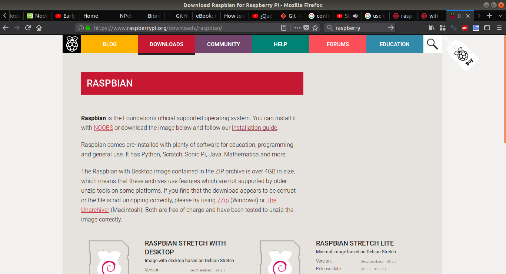
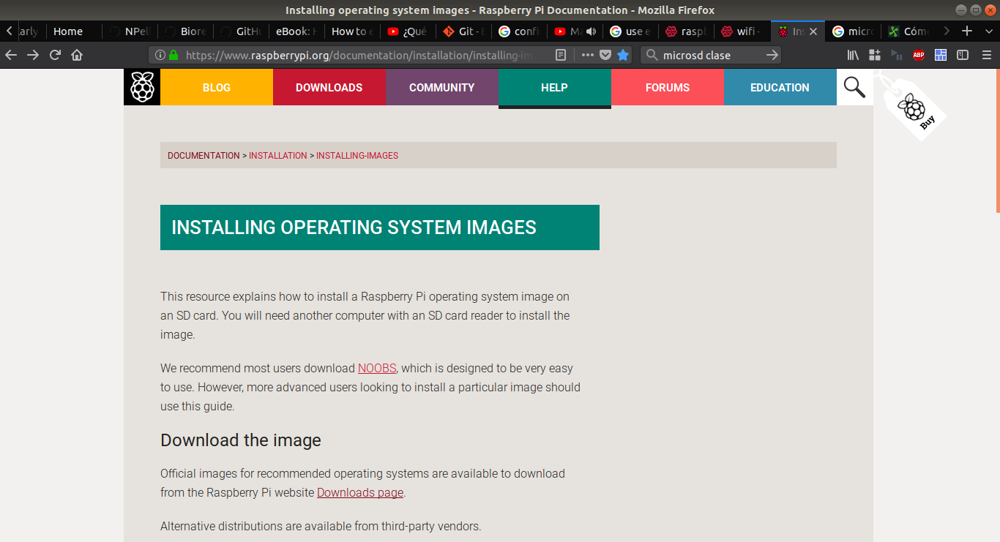
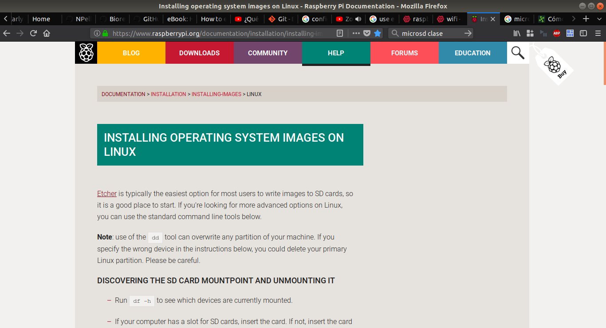
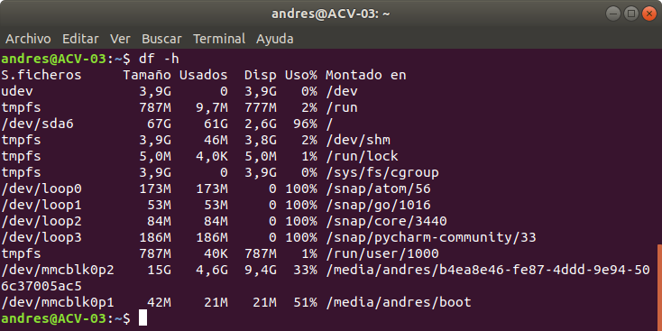
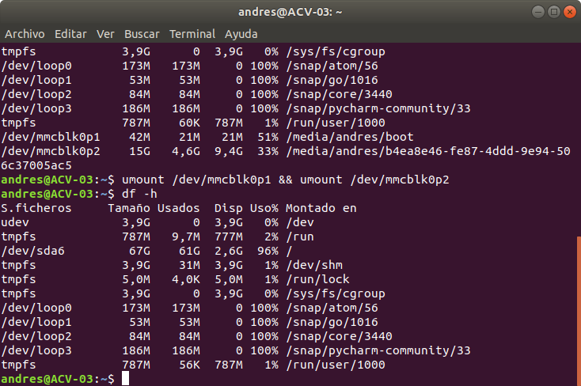
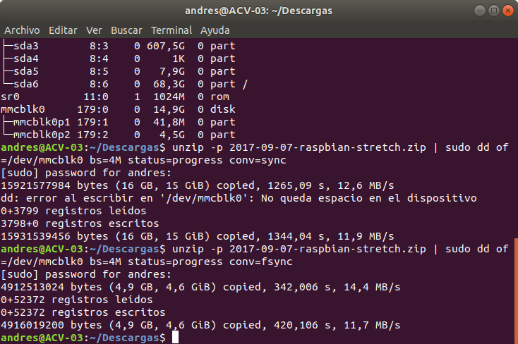
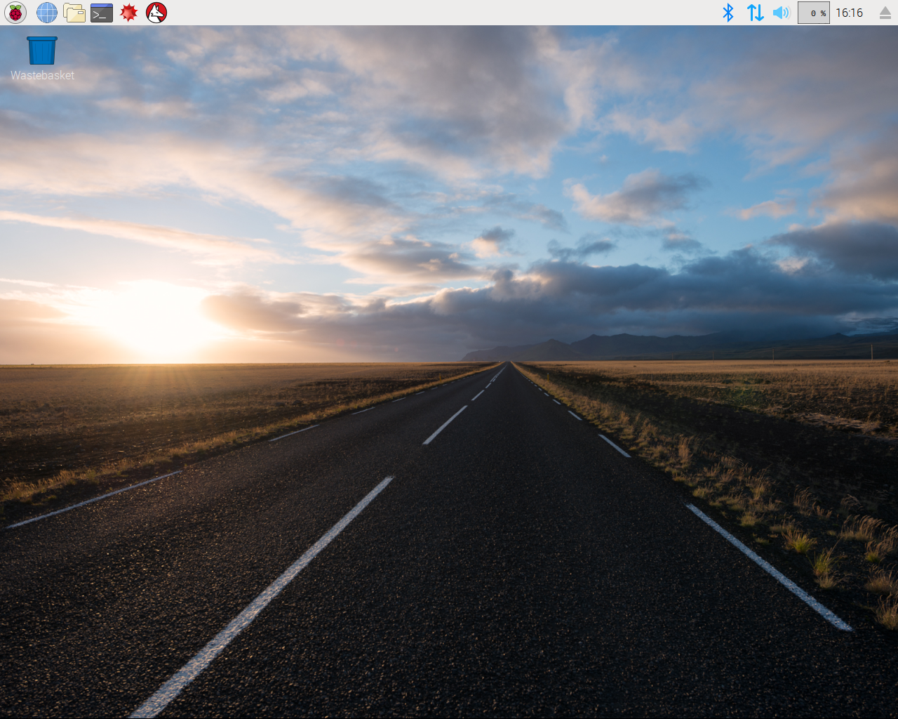

# ARDUINOM
## Installation from scratch in Raspberry Pi 3 Model B v1.2
## Raspbian, Node.js and Github Repository Installation

Document made by:
Andres Camilo Vargas Román (e-mail: andresc.vargasr@gmail.com; Github: @andrescvargasr)

1. Raspbian.

 1.2. Download.

 In this test, the operative system used is Raspbian Stretch version of September, 2017 (available in https://www.raspberrypi.org/downloads/raspbian/). See Figure 1.

 

 In this first step desktop version is used (Raspbian Stretch with Desktop).

 1.3. Installation

 To complete the operative system installation, it is recommended to use [class 10 microSD card](https://www.cnet.com/how-to/microsd-cards-for-android-how-to-choose-capacity-speed/) which guarantees a speed of at least 10 MB/s; also, it is recommended to do all the work from a Linux environment, since several packages and programs used do not need any additional installation of third-party software or components.

 On the Raspberry page (see Figure 2) you can find all the information [about installation](https://www.raspberrypi.org/documentation/installation/installing-images/README.md).

 

 In this case, at the end of the page we access installation guide through Linux (see Figure 3).

 

 - Insert the card into the computer and identify the _mountpoint_.
 - Run _df -h_ to find out which device is currently mounted (see Figure 4).

 

 After run _df -h_, two partitions are show in _/dev/mmcblck0pX_ (usually, two names are distinguished for the partitions of the cards: /dev/mmcblk0 or /dev/sdX), this is because an old version of Raspbian is installed on the card (after install a new version, please make a backup using this steps: https://thepihut.com/blogs/raspberry-pi-tutorials/17789160-backing-up-and-restoring-your-raspberry-pis-sd-card).

 - Run _umount /dev/mmcblk0p1 && umount /dev/mmcblk0p2_ and run _df -h_ again to see that each partition has been disassembled correctly (See Figure 5).

 

 - Copying the data to the SD card

 In order to copy the S.O. on the SD card, it must be located in the folder where the downloaded .zip file is located on the official page (available on: https://www.raspberrypi.org/downloads/raspbian/) Then:
 - Run the following command _unzip -p 2017-09-07-raspbian-stretch.zip | sudo dd
 of = / dev / mmcblk0 bs = 4M status = progress conv = fsync_ (see Figure 6).

 

 - Verify installation

 After the files are copied to the SD, the card is removed from the computer and connected to the Raspberry together with a screen with HDMI connection, a keyboard and a mouse (see Figure 7).

 

2. (Optional) Download updates and network settings

 The steps described below can be found on the W3Schools page (available on: https://www.w3schools.com/nodejs/nodejs_raspberrypi.asp).

DESDE AQUÍ

 2.2. Connection to the wireless network

 Open the terminal and configure the Raspberry Pi network.

 - Scan the available wireless networks by executing the following code: _sudo iwlist wlan0 scan_ (see Figure 8).

 

 Figure 8. Scanning of wireless networks.
◦ After identifying the network to which you are going to connect, you must remember the ESSID, for this case it is: ESSID: "univalle".

Execute the command to add the network and connect through the wireless network: sudo nano /etc/wpa_supplicant/wpa_supplicant.conf (see Figure 9).

Figure 9. Command to modify the wireless network.
◦ Next, write the following information in the file (see Figure 10):
network = {ssid = "univalle"
psk = "Univalle"
}

Figure 10. Storage of the wireless network data.
◦ Restart the S.O. to adjust the settings: sudo reboot.
◦ To know if communication with the wireless network has been established, the ifconfig wlan0 command is executed so that the IPv4 can be observed with its respective mask and broadcast (see Figure 11).
Figure 11. Verification of access to the wireless network.
2.2. Establish Ethernet connection (point-to-point - ad hoc)

In the case of the univalle network communication via ssh can not be established because the communication port is blocked, therefore communication will be established through an Ethernet communication and adjusting the connection parameters manually.

• Modify the interfaces file using the following code: sudo nano / etc / network / interfaces (Figure 12).
Figure 12. Command to access the configuration of the network ports.
• Enter the following text in the document to configure the eth0 port manually, and then save the file by pressing Ctrl + x without changing the name (see Figure 13):
auto eth0
iface eth0 inet manual

Figure 13. Manual configuration for access by ethernet port - eth0.
• Then, the file must be modified: sudo nano /etc/dhcpcd.conf, in this case it is sufficient to eliminate the numerals (#) of both the eth0 and static ip_address = 192.168.0.10 / 24 interfaces (see Figure 14).

Figure 14. Assignment of fixed IP to the ethernet port eth0.
• Save the file and restart the Raspberry.
• Finally, you can review the network connections by typing the ifconfig command where the configuration for eth0 and wlan0 is located (see Figure 15).
Figure 15. Wireless and ethernet connections.

After these configurations, the Raspberry will have access to the internet through its wireless connection over the univalle network and it can be remotely managed through the ssh protocol using ethernet.
2.3. Enabling SSH, changing the Hostname and password
Run the following command to access the Raspberry Pi settings: sudo raspi-config (Figure 16).
Figure 16. Raspberry configuration command.
•
(Figure 17) Go to the number 5 Interfacing Options.

Figure 17. Interface options.
•
Next, select P2 SSH (see Figure 18).
Figure 18. Enable SSH.
•
After enabling the SSH connection, the user password must be configured, therefore, enter the option 1 Change User Password (see Figure 19).

Figura 19. Cambiar contraseña de usuario.
•
Para este caso, la contraseña se ha establecido como: “instru2023” (Figura 20).
Figura 20. Ingreso de contraseña.
•
Para el siguiente paso, se ingresa a la opción 2 Hostname y se escribe raspi-2023-1 (ver Figura
21 y Figura 22).

Figura 21. Cambio de nombre host.
Figura 22. Ingreso de nuevo nombre host.
•
Para finalizar la configuración, se solicita reiniciar el sistema (ver Figura 23).

Figure 23. Restart to complete system configuration.
2.3.1.
•
Establish SSH connection in Linux
In the terminal of the computer connected by ethernet to the Raspberry is written: ssh [-Y] pi@192.168.0.10, then the password that was created previously is requested (see Figure 24).

Figure 24. Establish communication through SSH.
•
Before installing Node.js, it is recommended to update the package list of the systems using sudo apt-get update and after this, update the packages to their latest version with the command sudo apt-get dist-upgrade 9 (see Figure 25) .
Figure 25. Operating system update.
3. Node.js
9 It is recommended to carry out this step frequently in order to keep the S.O.

In order to avoid errors and obtain the recent and stable updates of the components used, the versions of the Node Version Manager - NVM (v0.33.6), Node.js (v8.9.1 LTS), Serialport (6.0.4 with support for Node.js v8.9.1 LTS) and MongoDB (v2.2.30).

3.1. Date update
In order to avoid possible errors when downloading or installing the packages, the system date is adjusted.
Execute the command (see Figure 26):
• date --set "2017-11-24 17:27"
Figure 26. Configuration of the time and date of the system.
3.2. Installation of NVM
To obtain the latest version of Node.js, NVM 10 is used, since being a package manager for Node.js, it provides the most updated versions of each of the necessary complements.
•
Execute the following installation command (see Figure 27):
curl -o- https://raw.githubusercontent.com/creationix/nvm/v0.33.6/install.sh | bash

Figure 27. Installation of Node Version Manager - NVM.
3.3.
Installation of Node.js
In this case, having installed NVM, the installation of Node.js is executed from this package, so that it is possible to select the version to be installed, which in this case, version 8.9.1 LTS is installed.
3.3.1.
•
Setting the date and time
Execute the following command (see Figure 28 and Figure 29):
nvm install 8.9.1

Figure 28. Node.js installation command

Figure 29. Correct completion of the installation for Node.js.
3.4.
Installation of Serialport
In previous installations an error has been found associated to the nonexistence of the serialport package originally used, therefore, a more current version is downloaded and with support for the version of Node.js installed.
•
Execute the following command (see Figure 30 and):
npm install serialport
Figure 30. Installation command for serialport.

Figure 31. Successful completion of the installation for serialport.
3.5.
Installation of MongoDB
In order for the system to be able to store the data delivered by the compatible Arduino system, a version of MongoDB must be installed, which is responsible for storing said data.
•
execute the following command (see Figure 32 and Figure 33):
sudo apt-get install mongodb
Figure 32. MongoDB installation command.

Figure 33. Correct completion of the installation for MongoDB.
4. Arduin
Now that you have all the necessary elements to install the project, it is time to clone it from your Github repository and execute the commands necessary for its installation and operation on the Node.js server.
4.2.
•
Clone the repository
For this, the following command must be executed (see Figure 34):
git clone https://github.com/Bioreactor/Arduinom.git

Figure 34. Cloning of the Arduinom repository in Github.
4.2.
Install Arduinom
4.2.1.
•
Access the project folder
Execute the command (see Figure 35):
cd Arduinom /
Figure 35. Access to the Arduinom project folder.
•
To install the project, the following command must be executed within the folder (see Figure 36 and Figure 37):
npm install
Figure 36. Installation of the Arduinom project.

Figure 37. Correct completion of the installation for Arduinom.
4.3.
Running the Node.js server
Finally, to observe if the project has been compiled correctly, the command is executed:
npm run server
(see Figure 38)

Figure 38. Running the Node.js server
And it is observed through an internet browser, if there is any page hosted in port 3000.
•
If the -Y command was invoked when using SSH, execute (see Figure 39):
chromium-google
Figure 39. Execution of the web browser through ssh -Y.
•
Otherwise, open a new terminal and execute (see Figure 40):
ssh -X pi@192.168.0.12 chromium-browser

Figure 40. Web browser execution using ssh -X.
•
Now, in the navigation bar, enter the following address (see Figure 41):
localhost: 3000
Figure 41. Correct access to the page http: // localhost: 3000.
•
To know the data that must be received from the equipment, the general link is accessed directly, which displays the interface shown in Figure 42:

Figure 42. Server user interface without device connection.
When connecting the Bioreactor equipment to the Raspberry Pi and refresh the page, you can see the ID of the device and with this, observe the graphs of the data it delivers, this information can be seen in Figure 43:

Figure 43. Server user interface with connected devices.
5. Common problems
•
The version of Node.js is inferior to the required one for the correct operation of the project.
◦ This happens when the Node.js version is installed using the command:
▪ sudo apt-get install node
◦ To solve this problem, you must first uninstall the current version:
▪ sudo apt-get unistall node-v59
Then, you should proceed to install NVM (section 3.2) and finally Node.js (section 3.3).
•
Excessive time to install NVM.
◦ This error can be associated with a misconfigured date, to solve this, cancel the installation by pressing Ctrl + c, after this, set the current date and time (see
section 3.3.1).
•
MongoError: failed to connect to server [localhost: 27017] on first connect [MongoError:
connect ECONNREFUSED 127.0.0.1:27017].

This error may be due to the fact that MongoDB is not installed and / or the installed version is not current. To correct the error, install MongoDB using the command:
▪ sudo apt-get install mongodb.
6. Annex A: Test of the Node.js server prior to the installation of Arduinom.
As the server Node.js is already installed on Raspbian, the next step is to develop a small code that we can see from the computer with Ubuntu.
•
First, it is located in the folder where you want to store the document and sudo nano firstNode.js is written (see Figure 44).
Figure 44. Creation of the firstNode.js test file.
•
Subsequently, the following code is written into the file (see Figure 45):
var http = require ('http');
http.createServer (function (req, res) {
res.write ('Hello World!');
res.end ();
}). listen (8080);

Figure 45. Code of the file firstNode.js.
•
When saving the file, it is already possible to invoke Node.js to execute the file. The
execution is done using the command node firstNode.js and from the computer with Ubuntu or other equipment connected to the network it is possible to access the code by typing in a web browser 192.168.0.10:8080 (see Figure 46).
Figure 46. Verification of the operation of the Node.js. server
